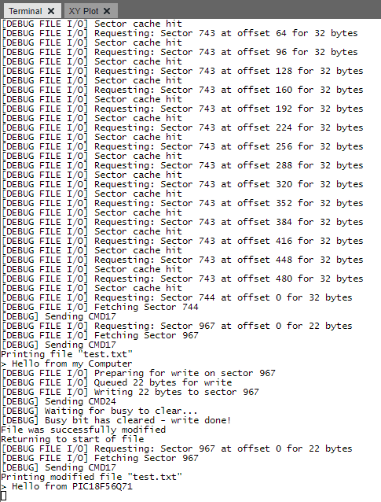

<!-- Please do not change this logo with link -->

# Petit FatFs on a Memory Card with PIC18F56Q71

[Petit FatFs](http://elm-chan.org/fsw/ff/00index_p.html) is a lightweight, open-source library for File Allocation Table (FAT) file systems. This example features a memory card interface and implements the Petit FatFs library to access the FAT file system on the card with the PIC18F56Q71 microcontroller.  

## Related Examples

- [FatFs on a Memory Card with PIC18F56Q71](https://github.com/microchip-pic-avr-examples/pic18f56q71-full-memory-card-mplab-mcc)
    - FatFs has a higher memory footprint than Petit FatFs, but is significantly more powerful

## Related Documentation

- [Petit FatFs API Documentation](http://elm-chan.org/fsw/ff/00index_p.html)
- [Memory Card Communication](http://elm-chan.org/docs/mmc/mmc_e.html)

## Software Used

- [MPLAB&reg; X IDE v6.1.5 or newer](https://www.microchip.com/en-us/tools-resources/develop/mplab-x-ide?utm_source=GitHub&utm_medium=TextLink&utm_campaign=MCU8_MMTCha_pic18q71&utm_content=pic18f56q71-lw-memory-card-mplab-mcc&utm_bu=MCU08)
- [MPLAB XC8 v2.45 or newer](https://www.microchip.com/en-us/tools-resources/develop/mplab-xc-compilers?utm_source=GitHub&utm_medium=TextLink&utm_campaign=MCU8_MMTCha_pic18q71&utm_content=pic18f56q71-lw-memory-card-mplab-mcc&utm_bu=MCU08)
- [MPLAB Code Configurator (MCC)](https://www.microchip.com/en-us/tools-resources/configure/mplab-code-configurator?utm_source=GitHub&utm_medium=TextLink&utm_campaign=MCU8_MMTCha_pic18q71&utm_content=pic18f56q71-lw-memory-card-mplab-mcc&utm_bu=MCU08)
- [Petit FatFs R0.03a (Included in Project)](http://elm-chan.org/fsw/ff/00index_p.html)

## Hardware Used

- [PIC18F56Q71 Curiosity Nano Evaluation Kit (EV01G21A)](https://www.microchip.com/en-us/development-tool/EV01G21A?utm_source=GitHub&utm_medium=TextLink&utm_campaign=MCU8_MMTCha_pic18q71&utm_content=pic18f56q71-lw-memory-card-mplab-mcc&utm_bu=MCU08)
- [Curiosity Nano Base for Click Boards&trade;](https://www.microchip.com/en-us/development-tool/AC164162?utm_source=GitHub&utm_medium=TextLink&utm_campaign=MCU8_MMTCha_pic18q71&utm_content=pic18f56q71-lw-memory-card-mplab-mcc&utm_bu=MCU08)
- [MICROSD Click (MIKROE-924)](https://www.mikroe.com/microsd-click)
- [2 GB Memory Card](https://www.amazon.com/Transcend-microSD-Without-Adapter-TS2GUSDC/dp/B001BNNZXO/)
    - Petit FatFs only supports small memory cards 

## Changes in v1.10

- Significantly improved compatability with memory cards
- Modified time-outs to match specification
- Upgraded XC8 / MPALB X / MCC Versions

## Setup

### Hardware Setup

With the power off, plug in the Curiosity Nano into the adapter board. Put the MICROSD Click in slot 1.

### Memory Card Setup

Before use, format the memory card as a FAT volume. Create a file called `test.txt` on the disk. In the file on the disk, type the following message:

`Hello from my Computer`

These steps are required since Petit FatFs cannot resize or create a file. This means the file needs to be large enough to contain the full text written at run-time. A copy of `test.txt` is also included in the repository. 

**Note**: This example supports hot-swapping memory cards, and does not require the card to be installed on power-up.  

### UART Setup

1. Plug in the Curiosity Nano.
2. Open MPLAB X IDE.
3. Click the **MPLAB Data Visualizer** button in the toolbar.  

4. Press the gear symbol on the COM port associated with the Curiosity Nano.  

5. Set the baud rate to 115200.
6. Click the terminal button to connect the COM port to the serial terminal.

Data will print when a memory card is inserted, as shown below.  

## Implementing Petit FatFs

Petit FatFs handles file system management, but does not handle communication with the memory card. The library requires three functions to be implemented:

- `disk_initialize`
- `disk_readp`
- `disk_writep`

These functions call the memory card API to perform file system tasks.  

## Theory of Operation

When a memory card is inserted, a switch in the socket pulls a detection line low. The microcontroller debounces this signal, then sets a flag to initialize the memory card outside of the interrupt handler. When inserted, the card may fail to initialize due to powering on delays, but the program will retry multiple times before erroring out. 

Communication with the memory card is via Serial Peripheral Interface (SPI). A series of commands are sent to the card to configure and prepare it for file read/write. For commands, the clock frequency is 400 kHz. During memory read/write, the clock frequency is increased up to a maximum of 10.6 MHz, depending on the memory card's indicated maximum.

During normal operation, the memory card API maintains a cache of the current sector to improve the performance of Petit FatFs.

## Operation

When a memory card is inserted, the program will initialize the card with the function `disk_initialize`. If the disk is initialized successfully, the file `test.txt` is read into a buffer by the function `pf_read`, then printed to the terminal. After this, the text in the file is overwritten with the message `Hello from PIC18F56Q71` via the function `pf_write`. Then, the file pointer is moved back to the start of the file with `pf_lseek` for another read operation to print the new text.

## Program Options

| Macro | Value | Description
| ----- | ----- | -----------
| MEM_CARD_DEBUG_ENABLE | Defined | Prints debug messages. If not defined, memory usage and performance will improve.
| MEM_CARD_FILE_DEBUG_ENABLE | Defined | Prints file operation requests. If not defined, memory usage and performance will improve.
| MEM_CARD_MEMORY_DEBUG_ENABLE | Not defined | Prints the raw memory bytes received from the memory card. If not defined, memory usage and performance will improve.
| MEM_CARD_DISABLE_CACHE | Not defined | Disables file system caching, at a cost to performance. Use for debugging only.
| MEMORY_CARD_IDLE_CLOCK_CYCLES | 10 | Sets the number of dummy bytes to send between commands
| R1_TIMEOUT_BYTES | 10 | How many bytes to wait for a valid response code
| DEFAULT_READ_TIMEOUT | 250 | Sets the timeout in milliseconds used for read operations
| DEFAULT_WRITE_TIMEOUT | 500 | Sets the timeout in milliseconds used for write operations
| INIT_RETRIES | 100 | How many times to try and send the initization command to the memory card
| FULL_RETRIES | 5 | This sets the number of times the system will attempt to initialize the memory card
| DISABLE_SPEED_SWITCH | Not defined | If defined, the card will remain at 400 kHz speeds for all communication. This will impact performance of read/write operations.
| CRC_VALIDATE_READ | Defined | If defined, block reads will verify the Cyclic Redundancy Check (CRC) of the data. **To reject bad data, set ENFORCE_DATA_CRC.**
| ENFORCE_DATA_CRC | Defined | If defined, block reads with a bad CRC will fail

**Note**: Petit FatFs has a set of macros to modify functionality and/or memory usage. See `pffconf.h` for more information.

## Summary

This example has demonstrated how to implement Petit FatFs on the PIC18F56Q71 family of microcontrollers.